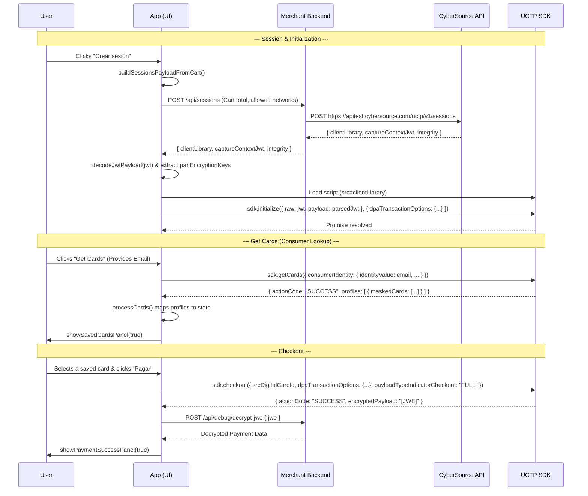

# UCTP Buttonless Demo (Java + Maven + Spring Boot)

Demo app for a “buttonless” Unified Click to Pay (UCTP) flow:
- UI page: `/uctp-buttonless`
- Backend endpoint: `POST /api/sessions` (server-to-server call to CyberSource Sessions API)

## Why `/sessions` (not `/capture-contexts`)?
UCTP starts with a **server-to-server** call to the **Sessions API**. The `captureContext` JWT used by the JS SDK (`initialize()`) comes from that backend sessions response.

## What This Project Does
- **Backend**
  - Calls `https://{vas.host}{vas.sessions.path}` to create a session.
  - Extracts the `captureContext` JWT and derives `clientLibrary` + `clientLibraryIntegrity` from it.
- **Frontend**
  - Loads the UCTP SDK using `clientLibrary` (+ integrity).
  - Runs a typical flow: `initialize()` → `getCards()` → OTP (if required) → `checkout()`.

## Prerequisites
- Java + Maven
- A configured CyberSource sandbox/project with HTTP Signature credentials:
  - `merchant.id`
  - `merchant.keyId`
  - `merchant.secretKey` (Base64)

## Configuration
Edit `src/main/resources/application.properties`:
- `vas.host` (default: `apitest.cybersource.com`)
- `vas.sessions.path` (default: `/uctp/v1/sessions`)
- `merchant.id`, `merchant.keyId`, `merchant.secretKey`

## Run (HTTP)
You can run the app over HTTP, but **UCTP `targetOrigins` must be HTTPS**, so you won’t be able to successfully create sessions from an HTTP origin.

- Start: `mvn spring-boot:run`
- Open: `http://localhost:8080/uctp-buttonless`

## Run (Local HTTPS for UCTP)
The easiest way to satisfy UCTP `targetOrigins` is to run the demo on HTTPS locally.

### 1) Generate a local self-signed keystore
Create a `PKCS12` keystore in the project root:

- `keytool -genkeypair -alias local-https -keyalg RSA -keysize 2048 -storetype PKCS12 -keystore local-keystore.p12 -validity 3650`
- Use password: `changeit`
- When prompted for host/name, use: `localhost`

### 2) Start with the HTTPS profile
This repo includes `src/main/resources/application-localhttps.properties`.

- `mvn spring-boot:run -Dspring-boot.run.profiles=localhttps`

### 3) Open the HTTPS URL
- `https://localhost:8443/uctp-buttonless`

Your browser will warn because the cert is self-signed; proceed for local testing.

### Keystore location note
`application-localhttps.properties` uses `server.ssl.key-store`. If you move the keystore under `src/main/resources/...`, use a classpath value, for example:
- `server.ssl.key-store=classpath:static/keystore/local-keystore.p12`

## Debug: Decrypt JWE (MLE)
If you enabled the UI debug call to `POST /api/debug/decrypt-jwe`, you must provide your MLE private key:
- Recommended for local dev: set `ctp.mle.private-key-path` (PEM PKCS#8) to a real file path on your machine.
- Recommended for Railway/containers: set the PEM via env var (no file needed):
  - `CTP_MLE_PRIVATE_KEY_PEM_BASE64` → maps to `ctp.mle.private-key-pem-base64`
  - (Alternative) `CTP_MLE_PRIVATE_KEY_PEM` → maps to `ctp.mle.private-key-pem` (supports literal `\\n`)
- Don’t commit key material (see `.gitignore`).

### Railway checklist
- Make sure the variable name is exactly `CTP_MLE_PRIVATE_KEY_PEM_BASE64` (uppercase + underscores).
- After setting/updating a variable, trigger a new deploy/restart so the running container picks it up.
- On startup, the app logs: `[CtpJweService] MLE private key configured? ...` (it prints booleans only, never the key).
- The Base64 value should be a single line; if Railway introduces whitespace/newlines, the app ignores them.

### Alternative: `SPRING_APPLICATION_JSON`
If you prefer setting Spring properties as JSON, you can set an env var like:
- `SPRING_APPLICATION_JSON={"ctp":{"mle":{"private-key-pem-base64":"<BASE64_PEM>"}}}`

## Notes / Troubleshooting
- If CyberSource rejects sessions with an origin error, double-check you’re running the UI at an HTTPS origin (for local: `https://localhost:8443`).
- `/sessions` response schema can differ by tenant; adjust parsing in `SessionsService` if your JWT field names differ.
- In production, validate JWT signatures and tighten origin allow-lists.

